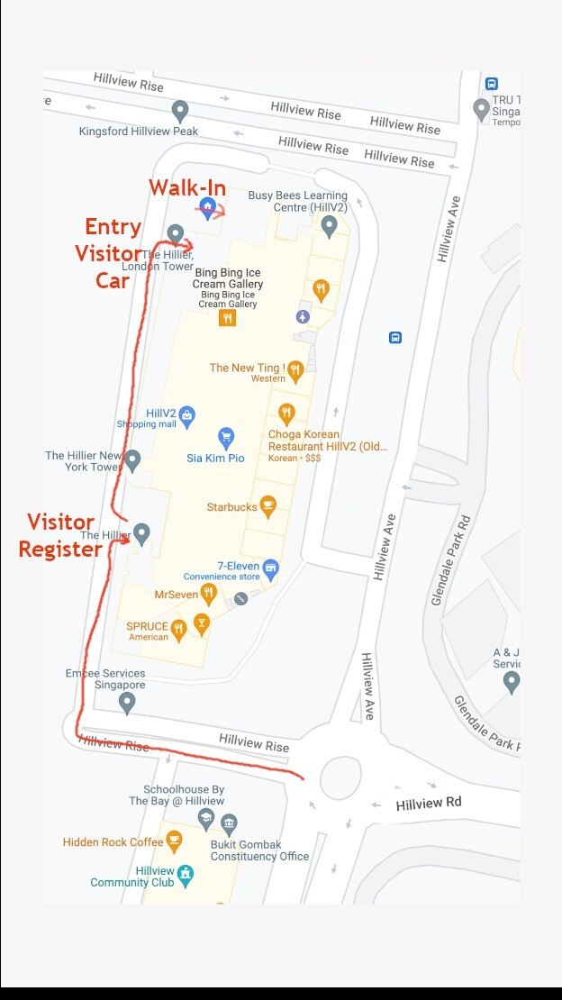
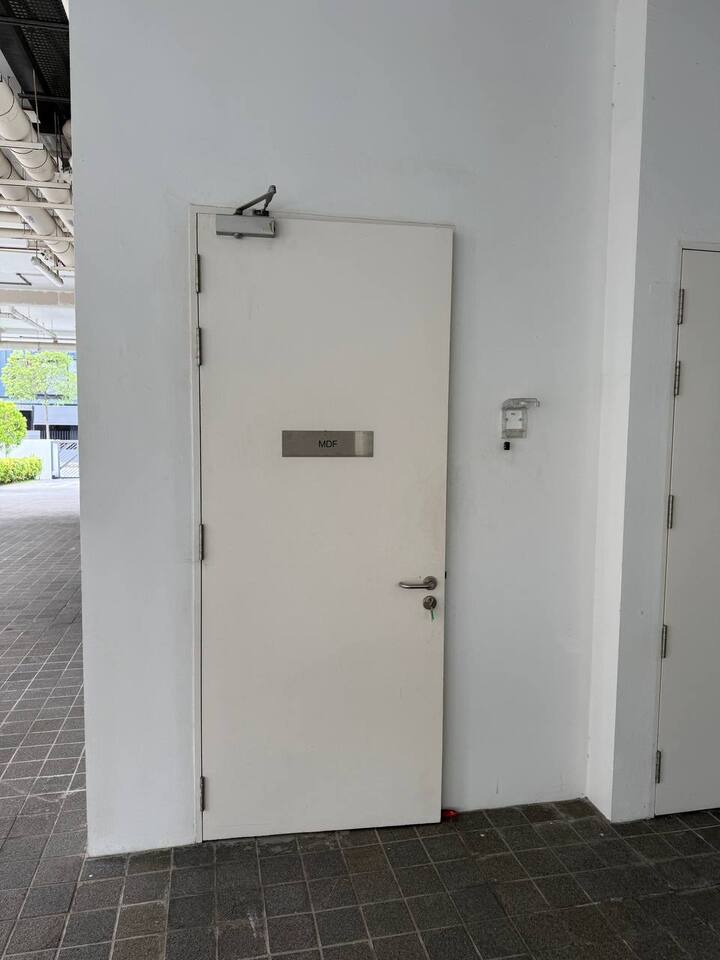

# Chat Log - 2026-04-25

## 聊天记录保存设置

**时间:** 2026-04-25 09:17 GMT+8  
**用户:** XJ ZHAO (老赵)  
**会话ID:** telegram:6606993867

### 请求内容

用户要求将聊天记录和传输的文件保存在工作目录中，按月份组织目录结构。

### 实施方案

- **根目录:** `/root/.openclaw/workspace-security/chat-records/`
- **月度目录:** `YYYY-MM` 格式 (例如: `2026-04`)
- **文件命名:** `YYYY-MM-DD-chat-log.md` 用于聊天记录

### 当前状态

✅ 目录结构已创建：
- `/root/.openclaw/workspace-security/chat-records/2026-04/`

✅ 本日聊天记录文件已创建：
- `2026-04-25-chat-log.md`

### 后续操作

所有后续聊天将按此结构保存：
- 聊天消息 → 追加到当月当日的 `chat-log.md`
- 传输的文件 → 保存到当月目录，按日期-时间命名

---

## 文件保存规则更新

**时间:** 2026-04-25 09:20 GMT+8

### 新要求

用户发送的照片或文件需要：
1. **保存到目录:** `chat-records/YYYY-MM/`
2. **文件命名格式:** `YYYY-MM-DD-HHMMSS-filename.ext`
3. **聊天记录:** 记录文件信息（文件名、保存路径、时间）

### 记录模板

```markdown
### 📎 文件接收

- **文件名:** [原始文件名]
- **保存路径:** [完整路径]
- **时间:** [时间戳]
- **类型:** [图片/文件]
- **图片嵌入:** 
- **尺寸调整:** 宽度最大720px，保持比例
```

---

## 聊天记录

### 2026-04-25 09:21 GMT+8

**用户:** XJ ZHAO (老赵)

**消息内容:** "这个是地址"

### 📎 文件接收

- **文件名:** file_0---bae48c02-8306-4fa0-adbe-2c191d3ebf1f.jpg
- **保存路径:** /root/.openclaw/workspace-security/chat-records/2026-04/2026-04-25-092100-address.jpg
- **时间:** 2026-04-25 09:21 GMT+8
- **类型:** 图片 (image/jpeg)
- **说明:** 地址照片
- **尺寸调整:** 原始尺寸 624x1110px，未超过720px，保持原尺寸



---

### 2026-04-25 10:06 GMT+8

**用户:** XJ ZHAO (老赵)

**消息内容:** "我上传给你的图片,如果太大, 你是否可以修改尺寸, 保持比例,但宽不大于720px"

### ⚙️ 功能配置

- **图片尺寸调整:** 已启用
- **最大宽度:** 720px
- **调整方式:** 保持宽高比，仅当宽度超过720px时缩小
- **工具:** ImageMagick (convert)

---

### 2026-04-25 10:08 GMT+8

**用户:** XJ ZHAO (老赵)

**消息内容:** "这个是lormelayu"

### 📎 文件接收

- **文件名:** file_1---c0e0f4d1-143d-4230-945a-841e2843e68e.jpg
- **保存路径:** /root/.openclaw/workspace-security/chat-records/2026-04/2026-04-25-100800-lormelayu.jpg
- **时间:** 2026-04-25 10:08 GMT+8
- **类型:** 图片 (image/jpeg)
- **说明:** lormelayu 照片
- **尺寸调整:** 原始尺寸 960x1280px → 调整后 720x960px (宽度超过720px，已缩小)
- **文件大小:** 48KB (原 81KB)



---
